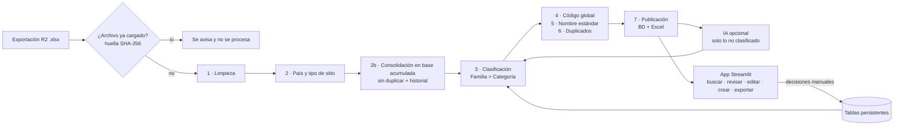
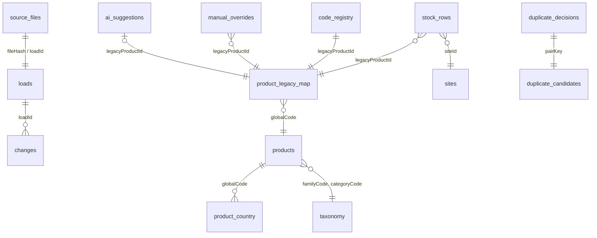

# RLA · Estandarización del maestro de productos

> Prueba técnica — Programa Ingeniería con la Empresa UDD × RLA Latam · **Problema #1: Productos e inventario sin estandarización**

Pipeline repetible + base de datos (Supabase / SQLite) + app web (Streamlit) que transforma la exportación de productos del
sistema **R2** —distinta en cada país— en un **maestro único de productos**: columnas estándar, país por sitio,
taxonomía común, código global, nombre estándar, detección de duplicados, historial de cargas y apoyo opcional de IA.

---

## Índice

1. [El problema](#1-el-problema)
2. [Lo que muestran los datos](#2-lo-que-muestran-los-datos)
3. [La solución en una mirada](#3-la-solución-en-una-mirada)
4. [Inicio rápido](#4-inicio-rápido)
5. [Configuración (`.env`)](#5-configuración-env)
6. [El pipeline paso a paso](#6-el-pipeline-paso-a-paso)
7. [Estructura del repositorio y qué hace cada archivo](#7-estructura-del-repositorio-y-qué-hace-cada-archivo)
8. [Archivos de configuración (`config/`)](#8-archivos-de-configuración-config)
9. [Base de datos](#9-base-de-datos)
10. [La app](#10-la-app)
11. [Asistente de IA](#11-asistente-de-ia)
12. [Repetibilidad: qué es automático y qué requiere a una persona](#12-repetibilidad-qué-es-automático-y-qué-requiere-a-una-persona)
13. [Decisiones de diseño](#13-decisiones-de-diseño)
14. [Resultados sobre el archivo entregado](#14-resultados-sobre-el-archivo-entregado)
15. [Despliegue en Streamlit Community Cloud](#15-despliegue-en-streamlit-community-cloud)
16. [Limitaciones y próximos pasos](#16-limitaciones-y-próximos-pasos)
17. [Solución de problemas](#17-solución-de-problemas)

---

## 1. El problema

RLA opera en varios países y administra su catálogo de equipos en R2. Hoy:

- **La codificación es manual y depende de cada país**: no existe un código común para el mismo equipo.
- **La nomenclatura es inconsistente**: el mismo producto se escribe de muchas formas, lo que aumenta el riesgo de crear fichas duplicadas.
- **La categorización es dispersa**: una misma familia de equipos queda repartida en categorías distintas.

**Resultado esperado:** una estructura de productos funcional para todos los países, que estandarice codificación,
nomenclatura y categorización, facilite crear y buscar productos, y mantenga la información ordenada en el tiempo.
Requisito transversal: **repetibilidad** — `nueva información → procesamiento → estandarización → consolidación → actualización de la solución`.

## 2. Lo que muestran los datos

Archivo de entrada: `Lista_Productos.xlsx` (hoja *Lista de productos*), **57.011 filas × 42 columnas**.

| Hallazgo | Evidencia |
|---|---|
| Granularidad | 1 fila = **producto × sitio** (bodega, hotel, centro de distribución). 7.890 códigos de producto × 137 sitios. |
| No hay columna de país | Se debe inferir desde el nombre del sitio y el prefijo del código. |
| Codificación sin estándar | Más de 40 formatos de código: `12573` (numérico, Chile), `CO ACC55` / `PE PRY26` (país + familia + correlativo), `CL CAB 02`, `SK179932521`, `XXX169`, `12755.1`, mnemónicos como `CTLREMPN`. |
| Uso cruzado de códigos | Sitios de Chile usan códigos `CO`, `PE` y `PA` (ej. CD Santiago: 113 productos con código CO). |
| Categorías superpuestas e incompletas | 5 campos de categoría: `DEPARTMENT` (39% vacío), `Availability Group` (72%), `Report Group` (85%), `EXCHANGEGROUP` (65%), `REVENUEGROUP` (mezcla nombres con códigos contables 3040/9010 y `XXXXXX`). |
| Errores de escritura | `AMPLIFICADOREWS`, `SWITH DE VIDEO`, `MEMRORIAS`; en descripciones `proyecor`, `patalla`, `inhalambrico`… |
| Marcas escritas de muchas formas | 622 variantes: `KRAMER`/`KRAMMER`, `BEHRINGER`/`BHERINGER`/`BERINGER`, `DA-LITE`/`DALITE`/`DA - LITE`; 58% de productos sin marca. |
| Duplicados | 793 descripciones compartidas por 2.048 códigos (ej. "Computador portátil" en 32 códigos); 285 combinaciones marca + modelo con más de un código. |
| Datos basura | Descripciones "eliminar", vacías o "."; sitios virtuales (`Ghost 22/24/2025`, `Diferencias Inv`, `otro.. NO USAR`, `Botar Chile`). |
| Formatos | Montos y stock como texto con formato latino (`90.000,00`); 6 columnas 100% vacías. |

## 3. La solución en una mirada



Principios:

- **Toda la lógica de negocio está en CSV** (`config/`): se ajusta sin programar.
- **Nada se borra**: las filas se consolidan, se marcan o se agrupan; el código original de R2 se conserva siempre.
- **Trazabilidad**: cada valor derivado guarda su **fuente** (`origen`, `regla_*`, `ia`, `manual`) y cada corrección de limpieza queda en un log.
- **Las personas deciden**: reglas e IA proponen; lo que se corrige en la app se guarda y se reaplica en cada carga.

## 4. Inicio rápido

> **Para revisar la solución no se necesita ninguna clave.** El repositorio incluye la base SQLite ya procesada (`db/rla_products.db`):
> al clonar y ejecutar, la app abre con todos los datos en modo local. Supabase y la IA son opcionales.

Requisitos: Python 3.10 o superior y (opcional) Git.

**1. Obtener el código** — no es necesario hacer *fork*; basta con clonar o descargar:

```bash
git clone https://github.com/VichoRamirez/RLA_Estandarizacion_Productos.git
cd RLA_Estandarizacion_Productos
```
Sin Git: en GitHub, botón **Code → Download ZIP**, descomprimir y abrir una terminal en esa carpeta.

**2. Instalar dependencias**

```bash
pip install -r requirements.txt
```

**3. Abrir la app**

```bash
streamlit run app/app.py        # se abre en http://localhost:8501
```
En Windows también se puede hacer doble clic en **`iniciar_app.bat`**.

**4. (Opcional) Configurar Supabase y/o IA con un archivo `.env`**

Sin `.env` la app funciona con `DB_BACKEND=sqlite` y la IA desactivada. Para activarlos, copiar la plantilla y completar los valores:

```bash
cp .env.example .env            # macOS / Linux
copy .env.example .env          # Windows (CMD)
Copy-Item .env.example .env     # Windows (PowerShell)
```

Luego editar `.env` con cualquier editor de texto:

```ini
DB_BACKEND=supabase                         # o sqlite
SUPABASE_URL=https://<proyecto>.supabase.co
SUPABASE_KEY=<clave de Supabase>            # ver §9.5
LLM_API_KEY=<clave de OpenRouter>           # vacío = IA desactivada
```

`.env` está en `.gitignore`: las claves nunca se suben al repositorio. Detalle de todas las variables en §5.

**5. Procesar un archivo nuevo**

Desde la app: **Cargar datos / IA → subir .xlsx → Ejecutar pipeline**. O por terminal:

```bash
python run_pipeline.py                       # toma el .xlsx más reciente de data/input/
python run_pipeline.py ruta/al/archivo.xlsx
```

Opciones del pipeline:

| Comando | Qué hace |
|---|---|
| `python run_pipeline.py` | Procesa el `.xlsx` más reciente de `data/input/` |
| `python run_pipeline.py ruta/archivo.xlsx` | Procesa un archivo específico |
| `python run_pipeline.py --force` | Reprocesa aunque el archivo ya se haya cargado (no duplica filas) |
| `python run_pipeline.py --no-ai` | No intenta clasificar con IA al final |
| `python run_pipeline.py --user NOMBRE` | Registra quién hizo la carga |
| `python run_pipeline.py --reprocess` | Recalcula los pasos 3–7 desde la base acumulada (aplica ediciones manuales y sugerencias de IA sin cargar archivo) |

Códigos de salida: `0` ok · `3` archivo ya cargado · `1` error.

## 5. Configuración (`.env`)

El archivo `.env` **no se sube al repositorio** (está en `.gitignore`). `.env.example` es la plantilla sin claves.
No hay claves escritas en el código: todo se lee desde variables de entorno.

| Variable | Uso | Valor por defecto |
|---|---|---|
| `DB_BACKEND` | `supabase` (Postgres en la nube) o `sqlite` (archivo local) | `sqlite` |
| `SUPABASE_URL` | URL del proyecto Supabase | — |
| `SUPABASE_KEY` | Clave de Supabase (publicable o secreta, ver §9.5) | — |
| `LLM_API_KEY` | Clave del proveedor de LLM (OpenRouter) | — (IA desactivada) |
| `LLM_BASE_URL` | Endpoint compatible con la API de OpenAI | `https://openrouter.ai/api/v1` |
| `LLM_MODELS` | Modelos en orden de preferencia, separados por coma (el 1° es el principal, los demás son fallback) | `inclusionai/ling-3.0-flash-vl:free, inclusionai/ling-3.0-flash-sante:free, nvidia/nemotron-3.5-lightning:free` |
| `LLM_RETRY_DELAY_SECONDS` | Espera antes de reintentar el mismo modelo | `0.1` |
| `LLM_RETRIES_PER_MODEL` | Reintentos por modelo antes de pasar al siguiente | `1` |
| `LLM_TIMEOUT_SECONDS` | Tiempo máximo por llamada | `60` |
| `LLM_BATCH_SIZE` | Productos por llamada al modelo | `25` |
| `LLM_AUTO_CLASSIFY` | Si es `true`, al cargar un archivo se intenta clasificar con IA lo que las reglas no resolvieron | `true` |

Las variables definidas en el sistema (por ejemplo, *Secrets* de Streamlit Cloud) tienen prioridad sobre `.env`.

## 6. El pipeline paso a paso

Orquestado por `run_pipeline.py`. Cada paso es un módulo en `src/` que puede ejecutarse solo.

### Paso 0 — Verificación del archivo (`step2b_merge.check_file`)
Se calcula la **huella SHA-256 del contenido**. Si ya existe en la tabla `source_files`, el archivo **no se procesa**
(aunque tenga otro nombre) y se informa cuándo y con qué nombre se cargó. `--force` permite reprocesarlo.

### Paso 1 — Limpieza (`src/step1_clean.py`)
1. **Columnas a camelCase en inglés** según `config/column_map.csv` (ej. `Product ID → legacyProductId`, `CANRENT → canRent`, `Bin Loaction → binLocation`).
   La comparación de nombres ignora mayúsculas, espacios y símbolos. Si llega una columna **nueva** se convierte automáticamente a camelCase y se marca en el reporte;
   si **falta** una esperada se crea vacía y también se reporta. Las 7 columnas vacías o sin información se descartan.
2. **Tipado**: montos y stock con formato latino (`90.000,50 → 90000.5`, admite valores mixtos); flags de texto a booleanos
   (`RENTABLE/NOTRENTABLE`, `SELLABLE/NOTSELLABLE`, `SUBRENT`, `FREIGHT`, `MISCITEM`) según `bool_map.csv`.
3. **Normalización de texto**: espacios múltiples, comillas dobles (`""`), tildes invertidas (`ò → ó`).
4. **Placeholders** (`placeholder_values.csv`): `S/N`, `S/M`, `XXXXXX`, `104728`… se vacían; `OEM`, `SIN MARCA`, `GENERICA` → `GENERICO`.
5. **Ortografía en descripciones** (`word_corrections.csv`): corrección por palabra completa respetando mayúsculas (`Proyecor → Proyector`).
6. **Marcas** (`manufacturer_aliases.csv`): primero se comparan sin espacios ni símbolos (`DA - LITE` = `DALITE` = `DA-LITE`) y luego se aplica el alias canónico (`KRAMMER → KRAMER`).
7. **Campos de grupo** (`availabilityGroup`, `reportGroup`, `department`, `revenueGroup`, `exchangeGroup`…): mayúsculas sin tilde + correcciones de `value_corrections.csv`.
8. **Candidatos a baja** (`deletion_patterns.csv`): descripciones con "eliminar", "no usar", "borrar", vacías o solo símbolos. **Se marcan, no se borran.**

Se conservan intactos `legacyProductId` (es la clave en R2; limpiarlo podría unir códigos distintos) y la descripción original (`descriptionOriginal`).

Salidas: `data/interim/01_clean.parquet`, `reports/01_cleaning_log.csv` (columna, valor antes, valor después, regla, filas afectadas) y `reports/01_column_mapping.csv`.

### Paso 2 — País y tipo de sitio (`src/step2_country.py`)
El país se asigna **por sitio**, con esta prioridad:

1. `config/sites_manual.csv` (decisión humana).
2. `config/country_rules.csv`: expresiones regulares sobre el nombre del sitio (ej. prefijo `H.C.` = hoteles de Colombia; `Lima`, `Miraflores` = Perú; `Panam` = Panamá).
3. Inferencia por prefijo de código: si ≥ 60% de los productos del sitio tienen prefijo `CO/PE/PA/CL/MX` (con un mínimo de filas y cobertura).
4. `SIN_ASIGNAR` → queda en el reporte para revisión.

El prefijo de código también se usa como **validación**: el reporte marca sitios donde el país por nombre no coincide con el prefijo dominante.
El **tipo de sitio** (`site_type_rules.csv`) distingue `CENTRO_DISTRIBUCION`, `VENUE_CLIENTE`, `SERVICIO_TECNICO` y `VIRTUAL_O_BAJA`
(Ghost, Diferencias, Botar, Remate…). Los sitios virtuales **no cuentan como disponibilidad**.

Salida: `data/interim/02_country.parquet` y `reports/02_sites.csv`.

### Paso 2b — Consolidación en la base acumulada (`src/step2b_merge.py`)
Cada fila del archivo se compara con la tabla `stock_rows` por la clave **(legacyProductId, siteId)** y una **huella de sus valores**:

| Caso | Acción | Historial (`changes`) |
|---|---|---|
| Fila nueva | Se inserta | `INSERT` |
| Fila idéntica a la existente | **No se escribe** (no se duplica) | — |
| Misma clave, valores distintos (stock, costo, descripción…) | Se actualiza | `UPDATE` campo a campo, con valor anterior y nuevo |
| Fila ausente cuyo **sitio sí viene** en el archivo | `isPresent = false` (no se borra) | `ABSENT` |
| Fila que estaba ausente y vuelve | `isPresent = true` | — (se cuenta como "reaparece") |

Las filas de sitios que **no** vienen en el archivo no se tocan: se pueden cargar archivos parciales (por ejemplo, solo Perú) sin afectar a los demás países.
Cada carga queda en `loads` (filas nuevas / actualizadas / sin cambios / ausentes / reaparecen) y el archivo en `source_files`.

Los pasos 3 a 7 trabajan sobre **toda la base acumulada vigente**, no solo sobre el último archivo.

### Paso 3 — Clasificación (`src/step3_classify.py`)
Taxonomía estándar en `config/taxonomy.csv`: **10 familias y 60 categorías**.

| Familia | Código | Categorías |
|---|---|---|
| Audio | `AUD` | MIC, REC, ALT, CON, AMP, PRO, DIR, INT, REP, SIS, ACC |
| Video | `VID` | PRY, PAN, LED, TEL, CAM, SWI, DIS, PRC, VCF, ACC |
| Iluminación | `ILU` | FOC, ROB, CTL, EFE, ACC |
| Informática | `INF` | NTB, TAB, PER, IMP, RED, ALM, SOF, ACC |
| Traducción simultánea | `TRA` | CAB, PUP, RCP, TRM, DEB, ACC |
| Cables y conectores | `CAB` | AUD, VID, RED, ENE, ADP |
| Electricidad | `ELE` | TAB, GEN, UPS, ACC |
| Estructura y montaje | `EST` | TRU, RIG, SOP, MOB, CAS |
| Paquetes y salones | `PAQ` | SAL, KIT |
| Servicios | `SRV` | TEC, LOG, SUB, OTR |

Resolución por producto:

1. **Override manual** guardado desde la app → fuente `manual` (siempre gana).
2. **Reglas priorizadas** de `category_rules.csv` (gana la de menor número de prioridad que calce):
   - 1–3: descripción de servicios (subarriendo, personal técnico, transporte/viáticos) → `regla_descripcion`
   - 4–5: tipo de producto `LABOR` / `MISCCHARGE` → `regla_tipo`
   - 10–99: descripción de equipos (cables, traducción, paquetes, audio, video, iluminación, informática, electricidad, estructura) → `regla_descripcion`
   - 100–123: grupos legacy (`exchangeGroup`, `reportGroup`, `availabilityGroup`) → `regla_grupo`
   - 125: `packageType = PACKAGE` → kit (`regla_tipo`)
   - 130+: departamento legacy (solo familia; categoría `ACC`/`OTR`) → `regla_departamento`
3. **Sugerencia de IA** (solo si ninguna regla aplicó) → `ia`.
4. Sin resultado → `sin_clasificar` (cola de revisión).

Las reglas son expresiones regulares con prioridad numérica. Los cables se subclasifican automáticamente (`cable_subtypes.csv`: energía, red, video, audio).

### Paso 4 — Código global (`src/step4_master.py`)
Formato **`FAM-CAT-NNNN`** (ej. `AUD-MIC-0012`, `VID-PRY-0261`); los no clasificados reciben `SCL-XXX-NNNN`.

- **Estable entre cargas**: la tabla `code_registry` guarda qué código global recibió cada código de R2; en la siguiente carga se reutiliza.
  Si una persona cambia la categoría de un producto, se emite un código nuevo dentro de la nueva categoría.
- **Equivalencias**: `product_legacy_map` relaciona cada código de R2 con su código global (`canonico`, `duplicado_exacto`, `duplicado_confirmado`).
- **Disponibilidad**: `product_country` indica, por producto y país, en qué sitios está habilitado, en cuáles tiene stock y el stock total
  (excluye sitios virtuales). El detalle producto × sitio está en `stock_rows`.

### Paso 5 — Nombre estándar (`src/step4_master.py`, `standard_name`)
**`Tipo + Marca + Modelo + Atributo clave`**

- **Tipo**: específico por palabra clave (`type_keywords.csv`: Televisor, Monitor, Cable HDMI, Micrófono lavalier, Notebook, Foco PAR…);
  si ninguna aplica, el primer segmento del nombre de la categoría.
- **Marca / modelo**: si existen (se omite `GENERICO`).
- **Sin marca ni modelo**: se usa la descripción corregida, quitando las palabras que ya están en el tipo (máx. 70 caracteres).
- **Atributo clave**: definido por categoría en `taxonomy.csv` y extraído de la descripción con `attribute_patterns.csv`
  (metraje `10 m`, pulgadas `55"`, lúmenes `5500 lm`, almacenamiento `512 GB` —toma el mayor valor—, potencia `575 W`, canales, pitch LED, medidas, puertos).
  Solo se agrega si no aparece ya en el nombre.

| Descripción R2 | Nombre estándar |
|---|---|
| Proyector 5500 Ansi Lumenes (EPSON POWERLITE 5510) | `Proyector EPSON POWERLITE 5510 5500 lm` |
| Passlide Targus (TARGUS AMP13US) | `Presentador inalámbrico TARGUS AMP13US` |
| Telon Electrico 5,88 x 4,35 | `Telón eléctrico 5,88 x 4,35` |
| Mouse Basico | `Mouse Basico` |

Si alguien edita el nombre en la app, queda como `manual` y no se regenera.

### Paso 6 — Duplicados (`src/step4_master.py`)
**No se borran filas por clave compuesta** (ver §13). Los duplicados se resuelven a nivel **producto**:

- **(a) Duplicados exactos → se consolidan automáticamente** bajo un mismo código global cuando coinciden descripción normalizada + marca + modelo + `itemCategory` + `productType` + familia + categoría.
  Se excluyen descripciones vacías o sin clasificar. El registro con más stock queda como canónico; el stock se suma.
- **(b) Duplicados aproximados → puntaje y revisión humana.** Dentro de cada categoría (excepto salones y servicios) se compara la descripción con `token_sort_ratio` (rapidfuzz) y se ajusta:

  | Señal | Ajuste |
  |---|---|
  | Similitud de texto (0–100) | base |
  | Misma marca | +10 |
  | Marca distinta (ninguna genérica) | −25 |
  | Mismo modelo | +15 |
  | Modelo distinto | −30 |
  | Números distintos en la descripción | −15 |
  | Atributo clave distinto | −25 |

  Pares con puntaje ≥ 85 van a `duplicate_candidates`. En la app se **confirman** (se fusionan en un solo código al reprocesar) o se **rechazan** (no vuelven a aparecer como pendientes). Las decisiones se guardan en `duplicate_decisions`.

- Productos marcados como candidatos a baja y sin stock quedan con estado `INACTIVO_REVISAR_BAJA`.

### Paso 7 — Publicación (`src/step7_publish.py`)
Reemplaza en la base de datos las tablas derivadas (`products`, `product_legacy_map`, `product_country`, `duplicate_candidates`, `taxonomy`),
actualiza `sites`, registra métricas en `run_log` y exporta **`data/output/maestro_productos_estandarizado.xlsx`** con 6 hojas:
maestro, disponibilidad por país, equivalencias, candidatos a duplicado, cola de revisión y sitios.

### Paso IA (opcional) — `src/ai_assist.py`
Si hay clave configurada y `LLM_AUTO_CLASSIFY=true`, al final de la carga se envían a la IA **solo los productos sin clasificar**;
luego se re-ejecutan los pasos 3–7 para aplicar las sugerencias. Detalle en §11.

## 7. Estructura del repositorio y qué hace cada archivo

```
RLA_Estandarizacion_Productos/
├── run_pipeline.py            Orquestador del pipeline (CLI)
├── iniciar_app.bat            Arranque en Windows (instala, procesa si hace falta, abre la app)
├── requirements.txt           Dependencias
├── .env.example               Plantilla de configuración (sin claves)
├── app/
│   └── app.py                 App Streamlit
├── src/
│   ├── common.py              Rutas, carga de .env, utilidades de texto y números
│   ├── schema.py              Esquema único de la BD + generador del SQL de Supabase
│   ├── store.py               Capa de datos (Supabase REST o SQLite)
│   ├── step1_clean.py         Paso 1: limpieza
│   ├── step2_country.py       Paso 2: país y tipo de sitio
│   ├── step2b_merge.py        Paso 0 y 2b: huella del archivo y consolidación sin duplicar
│   ├── step3_classify.py      Paso 3: clasificación
│   ├── step4_master.py        Pasos 4-5-6: código global, nombre estándar, duplicados
│   ├── step7_publish.py       Paso 7: publicación en BD + Excel
│   └── ai_assist.py           Asistente de IA (reintento + fallback)
├── config/                    Reglas de negocio editables (CSV)
├── db/
│   ├── schema_supabase.sql    Script para crear las tablas en Supabase
│   └── rla_products.db        Base SQLite (modo local)
├── data/
│   ├── input/                 Exportaciones de R2 (.xlsx)
│   ├── interim/               Resultados intermedios (parquet, no versionados)
│   └── output/                Excel del maestro + reports/ (trazabilidad)
└── docs/                      Documento de entrega (1 página)
```

### Detalle de los módulos

| Archivo | Responsabilidad | Funciones principales |
|---|---|---|
| `run_pipeline.py` | Orquesta la corrida: verifica el archivo, ejecuta pasos 1 → 2 → 2b → 3 → 4 → 7 y la IA opcional. | `main(args)`, `derive(base)` (pasos 3–7 sobre la base acumulada) |
| `src/common.py` | Rutas del proyecto, carga de `.env` sin dependencias externas, normalización de texto y números. | `load_env`, `load_config`, `norm_key` (minúsculas, sin tildes ni símbolos), `compact_key`, `to_camel`, `parse_latin_number`, `latest_input` |
| `src/schema.py` | Define **todas las tablas** (columnas, tipos, clave primaria) en un solo lugar. Lo usan SQLite y Supabase. `python src/schema.py` regenera `db/schema_supabase.sql`. | `TABLES`, `columns`, `postgres_ddl` |
| `src/store.py` | Capa de datos con dos backends intercambiables. Lectura paginada, upsert, update, delete y reemplazo de tablas; aplicación de overrides manuales. | `read_table`, `replace_table`, `upsert`, `insert`, `update`, `delete`, `ping`, `save_override`, `apply_overrides`, `log_run` |
| `src/step1_clean.py` | Limpieza y estandarización de columnas y valores; log de cada corrección. | `rename_columns`, `cast_types`, `clean_text`, `fix_words`, `apply_placeholders`, `normalize_manufacturer`, `normalize_groups`, `flag_deletions`, `run` |
| `src/step2_country.py` | País y tipo de sitio con reglas + validación por prefijo de código. | `code_country`, `first_match`, `run` |
| `src/step2b_merge.py` | Huella del archivo, comparación fila a fila contra la base acumulada, historial de cambios y registro de la carga. | `file_hash`, `check_file`, `run`, `current_base` |
| `src/step3_classify.py` | Asigna familia y categoría con reglas priorizadas, IA y overrides. | `compile_rules`, `classify_row`, `run` |
| `src/step4_master.py` | Atributo clave, nombre estándar, consolidación de duplicados exactos, fusiones confirmadas, código global estable, disponibilidad por país y candidatos a duplicado con puntaje. | `extract_attribute`, `product_type`, `standard_name`, `run` |
| `src/step7_publish.py` | Escribe las tablas derivadas en la BD y el Excel de salida; registra métricas. | `run` |
| `src/ai_assist.py` | Cliente de LLM compatible con OpenAI, con reintento y fallback entre modelos; guarda sugerencias marcadas como IA. | `cfg`, `available`, `LLMClient.complete`, `pending`, `run`, `test_connection` |
| `app/app.py` | Interfaz web (ver §10). | secciones de la app, `ai_classify_ui`, `excel_bytes`, `stock_for` |

## 8. Archivos de configuración (`config/`)

La lógica de negocio vive aquí: **se ajusta editando CSV, sin tocar código**.

| Archivo | Qué define | Ejemplo |
|---|---|---|
| `column_map.csv` | Nombre original → nombre camelCase, tipo (`text`/`number`/`bool`) y si se conserva | `Product ID,legacyProductId,text,y` |
| `bool_map.csv` | Etiquetas de R2 → verdadero/falso | `NOTRENTABLE,false` |
| `placeholder_values.csv` | Valores que significan "sin dato" o genérico, por columna (`*` = todas) | `model,S/N,null` |
| `word_corrections.csv` | Errores ortográficos en descripciones | `patalla,pantalla` |
| `manufacturer_aliases.csv` | Variantes de marca → marca canónica | `KRAMMER,KRAMER` |
| `value_corrections.csv` | Errores en campos de grupo | `exchangeGroup,SWITH DE VIDEO,SWITCH DE VIDEO` |
| `deletion_patterns.csv` | Patrones que marcan candidatos a baja | `\beliminar\b,Descripción indica eliminar` |
| `country_rules.csv` | Regex sobre nombre de sitio → país, con prioridad | `20,^h\.c\.,COLOMBIA` |
| `site_type_rules.csv` | Regex sobre nombre de sitio → tipo de sitio | `10,ghost\|diferencias…,VIRTUAL_O_BAJA` |
| `sites_manual.csv` | Asignación manual de país/tipo para sitios puntuales (gana sobre las reglas) | `siteId,country,siteType,notes` |
| `taxonomy.csv` | Familias, categorías y atributo clave de cada categoría | `VID,Video,PRY,Proyector,lumenes` |
| `category_rules.csv` | Reglas de clasificación: prioridad, campo, regex, familia, categoría | `50,description,\b(proyector\|lumen…)\b,VID,PRY` |
| `cable_subtypes.csv` | Subtipo de cable según palabras clave | `\b(hdmi\|sdi\|vga…)\b,VID` |
| `type_keywords.csv` | Tipo específico para el nombre estándar dentro de cada categoría | `VID,PAN,\b(tv\|televisor)\b,Televisor` |
| `attribute_patterns.csv` | Regex para extraer cada atributo clave | `largo,(\d+…)\s?(m\|mts\|metros)\b,m` |

## 9. Base de datos

### 9.1 Dos backends, un solo esquema
El backend se elige con `DB_BACKEND` en `.env`:

- **`supabase`**: Postgres en la nube, persistente y compartido. Acceso vía API REST (PostgREST) con `requests`.
- **`sqlite`**: archivo local `db/rla_products.db`. Sirve como modo offline o respaldo.

Ambos usan el mismo esquema, definido en `src/schema.py`. La barra lateral de la app muestra a qué base está conectada.

### 9.2 Tablas

**Control de cargas e historial (persistentes)**

| Tabla | Clave | Contenido |
|---|---|---|
| `source_files` | `fileHash` | Huella SHA-256 de cada archivo cargado, nombre, fecha, usuario, filas y carga asociada |
| `loads` | `loadId` | Una fila por carga: filas totales, nuevas, actualizadas, sin cambios, ausentes, reaparecidas, sitios del archivo, mensaje |
| `changes` | `loadId, legacyProductId, siteId, field` | Historial campo a campo (`INSERT`, `UPDATE`, `ABSENT`) con valor anterior y nuevo |

**Base acumulada (persistente, upsert)**

| Tabla | Clave | Contenido |
|---|---|---|
| `stock_rows` | `legacyProductId, siteId` | Producto × sitio limpio y con país: descripción, marca, modelo, grupos, sitio, país, tipo de sitio, stock, costos, flags, huella (`rowHash`), primera y última carga, `isPresent` |

**Decisiones humanas y de IA (persistentes; el pipeline las lee y nunca las borra)**

| Tabla | Clave | Contenido |
|---|---|---|
| `manual_overrides` | `legacyProductId, field` | Correcciones hechas en la app (categoría, marca, modelo, atributo, nombre), con valor anterior, usuario y fecha |
| `ai_suggestions` | `legacyProductId` | Propuestas de la IA: familia, categoría, marca, modelo, atributo, confianza, justificación, modelo usado |
| `duplicate_decisions` | `pairKey` | Pares confirmados o rechazados como duplicado |
| `code_registry` | `legacyProductId` | Código global emitido para cada código de R2 (estabilidad entre cargas) |
| `new_products` | `globalCode` | Productos creados desde la app, pendientes de alta en R2 |
| `run_log` | `runAt, step, metric` | Métricas de cada corrida |

**Tablas derivadas (se recalculan en cada carga sobre la base acumulada)**

| Tabla | Clave | Contenido |
|---|---|---|
| `products` | `globalCode` | Maestro: nombre estándar, familia, categoría, marca, modelo, atributo clave, códigos de R2 asociados, países, stock total, estado, **fuente de cada campo** y `aiFields` |
| `product_legacy_map` | `legacyProductId` | Equivalencia código R2 → código global y tipo de relación |
| `product_country` | `globalCode, country` | Sitios habilitados, sitios con stock y stock total por país |
| `duplicate_candidates` | `pairKey` | Pares con puntaje, razones y decisión |
| `sites` | `siteId` | Sitio → país, fuente de la asignación, tipo de sitio, validación por prefijo |
| `taxonomy` | `familyCode, categoryCode` | Copia de la taxonomía vigente |

### 9.3 Relaciones principales



### 9.4 Cómo se evita duplicar
1. **Archivo**: huella SHA-256 en `source_files` → el mismo contenido no se procesa dos veces.
2. **Fila**: clave `(legacyProductId, siteId)` + `rowHash` → filas idénticas no se escriben; las que cambian se actualizan (upsert).
3. **Producto**: duplicados exactos se agrupan bajo un código global; aproximados van a revisión.
4. **Decisiones**: todas las tablas persistentes tienen clave primaria y se escriben con upsert.

### 9.5 Configurar Supabase
1. En el proyecto de Supabase: **SQL Editor → New query**, pegar el contenido de `db/schema_supabase.sql` y ejecutar (es idempotente).
2. En `.env`: `DB_BACKEND=supabase`, `SUPABASE_URL` y `SUPABASE_KEY`.
3. Ejecutar `python run_pipeline.py` (la primera carga sube ~57 mil filas; toma unos minutos).

**Seguridad (MVP):** el script activa *Row Level Security* y crea políticas `mvp_anon_all` para que funcione con la **clave publicable**.
Eso permite a cualquiera con la URL y esa clave leer y escribir. Para producción: usar la **clave secreta** (`sb_secret_...`) solo en el servidor
(omite RLS) y eliminar las políticas `mvp_anon_all`.

Si Supabase no responde, basta con `DB_BACKEND=sqlite` para seguir trabajando en local.

## 10. La app

`streamlit run app/app.py`. Barra lateral: selector de sección, usuario (para trazabilidad) y estado de la conexión a la base.

| Sección | Qué permite |
|---|---|
| **Resumen** | Indicadores: códigos R2 vs. códigos globales, % clasificado, campos completados por IA, pares de duplicado pendientes, sitios sin país. Gráficos por familia, origen de la clasificación, productos con stock por país y completitud de atributos. Historial de corridas. Botón **🤖 Intentar clasificar con IA** si hay productos sin clasificar. |
| **Buscar producto** | Búsqueda por nombre, descripción, código global o código R2, **tolerante a errores de escritura**. Filtros por familia, país con stock, estado y "solo con IA". Ficha del producto: campos con su fuente, códigos R2 equivalentes, disponibilidad por país, detalle por sitio e historial de cambios. **Descargar Excel con los filtros aplicados** (productos, disponibilidad, equivalencias, detalle por sitio opcional y hoja con los filtros usados; con autofiltro). |
| **Revisar y editar** | Tabla editable de productos pendientes (sin clasificar o con campos de IA), solo IA, sin clasificar o todos. Se puede cambiar categoría (lista desplegable), marca, modelo, atributo clave y nombre. Al guardar, cada cambio queda como **✍️ manual** y se reaplica en futuras cargas. |
| **Duplicados** | Pares candidatos con puntaje y razones; filtros por puntaje, estado y familia. Se marca **CONFIRMADO** (se fusionan en un código al reprocesar) o **RECHAZADO**. |
| **Historial de cargas** | Todas las cargas con su resumen (nuevas, actualizadas, sin cambios, ausentes), cambios de cada carga descargables en Excel y archivos registrados. |
| **Crear producto** | Alta asistida: al escribir la descripción sugiere la categoría (mismas reglas del pipeline), **muestra productos similares ya existentes** para evitar duplicar, propone el siguiente código global de la categoría y arma el nombre estándar. Queda en `new_products` como pendiente de alta en R2. |
| **Cargar datos / IA** | Subir una exportación `.xlsx`; aviso si el archivo ya fue cargado (con opción de reprocesar); ejecutar el pipeline con progreso; descargar el Excel del maestro. Panel de IA: modelos configurados, probar conexión, ejecutar IA (solo categoría o también marca / modelo / atributo) y ver las sugerencias registradas. |

## 11. Asistente de IA

**La IA propone, las personas deciden.**

- **Qué hace**: propone la categoría de los productos que las reglas **no** clasificaron y, si se pide, marca / modelo / atributo clave **solo donde están vacíos**.
  El prompt incluye la taxonomía completa y exige responder solo con códigos válidos; no debe inventar marcas ni modelos que no estén en la descripción.
- **Cómo se marca**: cada campo completado por IA queda con fuente `ia`; la columna `aiFields` de `products` lista cuáles. En la app aparecen con 🤖.
- **Corrección**: cualquier edición en *Revisar y editar* reemplaza el valor de la IA y queda como `manual`.
- **Conexión**: API compatible con OpenAI (OpenRouter por defecto), con `urllib` estándar.

Política de conexión, por cada lote de productos:

```
modelo 1 ──falla──> espera 0,1 s ──> reintento modelo 1 ──falla──> modelo 2 (misma política) ──> modelo 3 ...
    │                                        │                              │
  éxito                                    éxito                         éxito  → se guarda el lote
si ningún modelo responde → "El archivo no se pudo analizar con IA"; lo no procesado queda en la cola de revisión
```

La app muestra el estado en vivo: *Intentando conectar*, *Reintentando*, *Fallback*, *Procesando lote x/y*, *Éxito* / *No se pudo conectar*.

**Si se interrumpe**: cada lote se guarda completo en `ai_suggestions` apenas el modelo responde; el lote en curso se pierde.
Los lotes guardados se aplican en el siguiente reproceso (botón de IA, nueva carga o `python run_pipeline.py --reprocess`), y la IA retoma solo los productos que aún no tienen sugerencia.

## 12. Repetibilidad: qué es automático y qué requiere a una persona

Cuando llega un archivo nuevo del mismo tipo el próximo mes:

| Paso | Automático | Requiere intervención |
|---|---|---|
| Verificación del archivo | Detecta si ya se cargó | — |
| Columnas y tipos | Renombre y tipado; columnas nuevas se convierten solas | Revisar `01_column_mapping.csv` si aparece una columna NUEVA o FALTANTE |
| Ortografía y marcas | Diccionarios existentes | Agregar errores nuevos a los CSV |
| País | Sitios conocidos o reconocibles por nombre | Sitios nuevos `SIN_ASIGNAR` → `sites_manual.csv` |
| Consolidación | Nuevas / actualizadas / sin cambios / ausentes + historial | — |
| Categoría | ~95% por reglas (+ IA opcional) | Cola "sin clasificar" y validar lo marcado 🤖 |
| Código global y nombre | Emisión estable | — |
| Duplicados | Exactos se consolidan solos | Confirmar o rechazar pares aproximados |
| Publicación | BD + Excel | — |

Las decisiones manuales (overrides, duplicados, sitios, IA aceptada) se guardan en la base y se **reaplican automáticamente**: cada mes solo se revisa lo nuevo.

## 13. Decisiones de diseño

- **No eliminar filas por clave compuesta.** Con la clave (descripción, fabricante, itemCategory, type, siteId) se borrarían 1.888 filas, 379 de ellas con stock (1.500 unidades),
  de productos distintos (ej. descripciones "." con costos distintos). Además la clave no incluye modelo y el 58% no tiene marca.
  El sitio es una dimensión del inventario, no de la identidad del producto: los duplicados se resuelven a nivel producto y los códigos de R2 se conservan en la tabla de equivalencias.
- **El código de R2 nunca se modifica**: es la clave con la que opera el sistema origen.
- **Acumular en vez de reemplazar**: permite historial, archivos parciales por país y cargas repetidas sin duplicar.
- **Reglas en CSV antes que IA**: son deterministas, auditables y gratis; la IA se usa solo para el remanente y siempre marcada.
- **Sitios virtuales fuera de la disponibilidad**: Ghost, Diferencias, Botar, etc. no representan stock utilizable.
- **SQLite como respaldo de Supabase**: la demo no depende de la red.

## 14. Resultados sobre el archivo entregado

| Métrica | Valor |
|---|---|
| Filas procesadas (producto × sitio) | 57.011 |
| Columnas | 42 → 35 estandarizadas en camelCase (7 descartadas) |
| Variantes de marca | 622 → 550 |
| Correcciones registradas | 429 palabras en descripciones, 1.919 filas de marca, 728 valores de grupo, 913 placeholders |
| Sitios con país asignado | 121 de 137 (16 `SIN_ASIGNAR`, mayoría virtuales) |
| Productos clasificados por reglas | 94,7% (406 a revisión o IA) |
| Códigos R2 → códigos globales | 7.890 → 7.646 (244 duplicados exactos consolidados) |
| Pares candidatos a duplicado | ~1.950 con puntaje ≥ 85 |
| Productos con atributo clave extraído | ~1.640 |
| Tiempo de una carga completa | ~1,5 min (SQLite); algo más con Supabase |

Pruebas de repetibilidad realizadas: mismo archivo (bloqueado por huella), mismo contenido re-guardado (0 nuevas, 57.011 sin cambios),
archivo modificado (2 nuevas, 5 actualizadas, 3 ausentes, con historial) y archivo parcial solo de Perú (sin afectar a otros países).

## 15. Despliegue en Streamlit Community Cloud

1. En [share.streamlit.io](https://share.streamlit.io): *New app* → este repositorio → rama `main` → archivo principal **`app/app.py`**.
2. En *Settings → Secrets*, definir las mismas variables del `.env`:
   ```toml
   DB_BACKEND = "supabase"
   SUPABASE_URL = "https://<proyecto>.supabase.co"
   SUPABASE_KEY = "..."
   LLM_API_KEY = "..."
   LLM_MODELS = "inclusionai/ling-3.0-flash-vl:free,inclusionai/ling-3.0-flash-sante:free,nvidia/nemotron-3.5-lightning:free"
   ```
3. Con `DB_BACKEND=supabase` los datos persisten aunque la app se reinicie. Con `sqlite`, los cambios hechos en la nube se pierden al reiniciarse.

## 16. Limitaciones y próximos pasos

- **Reglas de clasificación**: cubren ~95%; los nuevos patrones deben incorporarse a `category_rules.csv` (o aprobarse vía IA + revisión).
- **Atributo clave**: se extrae solo cuando aparece en la descripción con un formato reconocible.
- **Marca**: el 58% de los productos no la trae en R2; la IA puede completarla solo si está en la descripción.
- **Seguridad**: el MVP usa políticas abiertas para la clave publicable; en producción, clave secreta en el servidor, autenticación de usuarios y roles (quién puede aprobar duplicados o altas).
- **Integración**: hoy la entrada es la exportación Excel de R2; el siguiente paso sería leer directo desde R2 (API o base) y devolver a R2 los códigos globales y altas aprobadas.
- **Escala**: con millones de filas convendría mover la consolidación a SQL dentro de Postgres (en vez de pandas) y cargar por lotes incrementales.

## 17. Solución de problemas

| Síntoma | Causa probable | Solución |
|---|---|---|
| La barra lateral muestra "BD no disponible" | Faltan variables o no se ejecutó el esquema | Revisar `.env`; ejecutar `db/schema_supabase.sql`; o usar `DB_BACKEND=sqlite` |
| "Conectado, pero faltan tablas o permisos" | Esquema no creado o políticas faltantes | Ejecutar `db/schema_supabase.sql` completo |
| "El archivo ya fue cargado" | Mismo contenido que una carga anterior | Es el comportamiento esperado; usar *Reprocesar de todas formas* / `--force` si se necesita recalcular |
| "IA no configurada" | `LLM_API_KEY` vacía | Completar `.env` y reiniciar la app |
| "No se pudo conectar con ningún modelo" | Modelos inexistentes, sin cuota o sin red | *Probar conexión*; revisar nombres en `LLM_MODELS`; los productos quedan en la cola de revisión |
| Sugerencias de IA no aparecen tras detener el proceso | Los lotes guardados aún no se aplican | Presionar de nuevo el botón de IA o `python run_pipeline.py --reprocess` |

---

**Herramientas:** Python (pandas, rapidfuzz, openpyxl, pyarrow, requests), Supabase (Postgres + PostgREST) / SQLite, Streamlit, LLM gratuitos vía OpenRouter.
Se usó Claude como asistente de análisis de datos y desarrollo.
